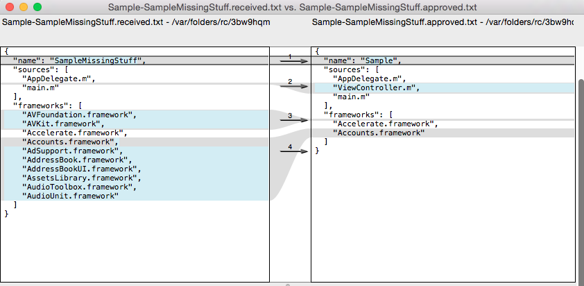

# diffXcodeTargets

Command line tool that can be used to diff two Xcode targets.

:warning: :warning: :warning: this is a bit of an early spike :construction: :construction: :construction:

# Sample of a diff

# How to Install

`npm install -g diffxcodetargets`

# Usage

&nbsp;&nbsp;`diffXcodeTargets projectFilePath targetA targetB`

&nbsp;&nbsp;&nbsp;&nbsp;&nbsp;&nbsp;  **[--version]**          : Prints just the version

&nbsp;&nbsp;&nbsp;&nbsp;&nbsp;&nbsp;  **[--help]**             : Prints this help info

&nbsp;&nbsp;&nbsp;&nbsp;&nbsp;&nbsp;  **[--debug]**            : Logs extra diagnostic debug info

# Example(s)

`diffXcodeTargets ./myProject.xcodeproj/project.pbxproj targetA targetB`
